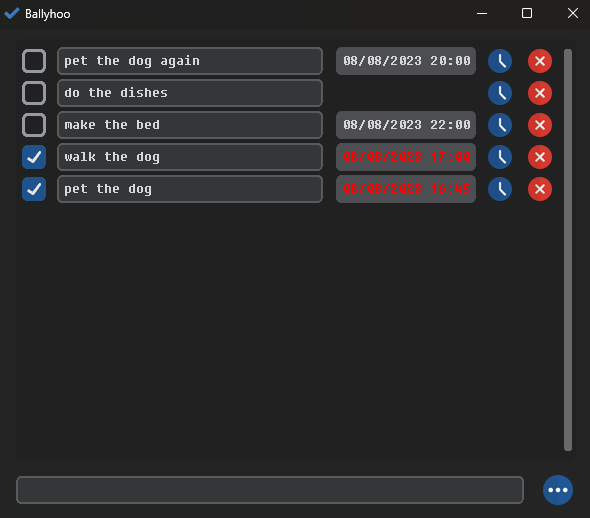

# Ballyhoo

Ballyhoo is a simple to-do list built with [CustomTkinter](https://github.com/TomSchimansky/CustomTkinter). The layout and functionality is inspired by Apple Reminders.

<p align="center">
  
</p>

## Installation

Extract `ballyhoo.zip` and run `main`.

## Dependencies

* `python3`
* `customtkinter`
* `pillow`

## Building from source

### Linux and macOS

Simply run the `scripts/build.sh` script.

### Windows

To obtain the path to site-packages, simply run `pip show customtkinter`.

```
pyinstaller --noconfirm --onedir --windowed --hidden-import='PIL._tkinter_finder' --add-data '<site-packages path>/customtkinter;customtkinter' --add-data 'resources/remove.png;.' 'src/main.py'
```
